# AutoOS: Next-Gen Enterprise Vehicle Service Center Management System
## Architectural Blueprint, Domain Specifications & Implementation Roadmap

> **Author / Lead Architect:** Vikum Theekshana Dahanayake  
> **Target System:** AutoOS (Enterprise Smart Workshop Operating System)  
> **Architecture Pattern:** Modular Monolith with Decoupled Edge AI & IoT Services  
> **Database:** PostgreSQL 16 (ACID Relational Ledger + JSONB Spatial Metadata)  
> **Core Frameworks:** NestJS 10 (Backend Core), Next.js 14 App Router (Dashboard), Flutter (Advisor Mobile/Tablet)

---

## 1. Executive Summary & Problem Space

Traditional Workshop Management Systems (e.g., Tekmetric, Shopmonkey, Mitchell 1) are built around desktop-era paradigms that fail in modern physical garages. They suffer from four critical operational bottlenecks:

1. **The "Greasy Hands" Friction:** Mechanics working with oil-covered hands refuse to type on tablets or dirty workstation keyboards, causing severe data loss, untracked labor hours, and missing parts billing.
2. **Bulk Fluid Shrinkage & Pilferage:** While discrete parts (spark plugs, filters) are easily counted, bulk fluids (engine oil, transmission fluids, coolants) stored in 209L drums suffer 15%–25% unbilled loss due to unauthorized dispensing and lack of physical-digital interlocks.
3. **Static Scheduling Collapse:** When a vehicle in a service bay suffers a delay (e.g., a seized bolt requiring 2 hours of torch work), static calendar schedules collapse, leaving technicians idle and customers frustrated.
4. **EV & Hybrid Diagnostic Blindness:** Legacy systems are strictly ICE-oriented and cannot log High-Voltage (HV) battery degradation, individual cell voltage balance ($\Delta V$), or issue certified Battery Health Passports.

**AutoOS** solves these fundamental gaps by integrating **Edge AI Computer Vision, IoT Hardware Flow-Meter Interlocks, Hands-Free Voice-to-Job Assistant, Dynamic Constraint-Based Bay Rebalancing, and EV Battery Diagnostics** into an enterprise-grade platform.

---

## 2. High-Level System Architecture & Topology

```mermaid
graph TD
    subgraph Physical Workshop & Hardware Layer
        IPCams[4-Angle IP Cameras RTSP] --> EdgeServer[Edge Server: Jetson / Local GPU]
        EdgeServer -->|ANPR & YOLOv8 Segmentation| EdgeAPI[Edge Vision Service :8000]
        TreadSensor[Driveway Optical Tread Sensor] --> EdgeServer
        
        OilGuns[Oil Dispenser Guns ESP32] -->|MQTT Telemetry| MQTTBroker[MQTT Broker: EMQX :1883]
        Solenoid[Solenoid Lock Valve] <---|Relay Cutoff Trigger| OilGuns
        
        OBDDongle[OBD-II Dongle BLE/WiFi] -->|Battery Telemetry| TelemetryIngest[Telemetry Gateway]
        Headsets[Bone-Conduction BT Headsets] -->|WebRTC Audio Stream| VoicePipeline[Whisper STT + LLM Parser]
    end

    subgraph Application Core - NestJS Modular Monolith
        APIGateway[NestJS API Gateway :5000]
        WSGateway[Socket.io Real-time Gateway]
        
        WorkOrderModule[WorkOrder & JobCard State Machine]
        FloorModule[Dynamic Constraint Bay Dispatcher]
        InventoryModule[Inventory & IoT Dispense Ledger]
        BillingModule[Split-Billing & Invoicing]
        GatePassModule[Cryptographic QR Gate Pass]
        CRMModule[Predictive Mileage Retention Engine]
        
        APIGateway --> WorkOrderModule
        APIGateway --> FloorModule
        APIGateway --> InventoryModule
        APIGateway --> BillingModule
        APIGateway --> GatePassModule
        APIGateway --> CRMModule
    end

    subgraph Storage & Infrastructure
        Postgres[(PostgreSQL 16 Relational Ledger + JSONB)]
        Redis[(Redis Cache & BullMQ Queue)]
    end

    subgraph Client Applications
        AdminBayUI[Next.js 14 Executive Dashboard & Bay Kanban :3000]
        AdvisorApp[Flutter Tablet Inspection App]
        CustomerPortal[Customer PWA / WhatsApp Cloud API]
        SecurityGateUI[Gate Security Terminal Scanner]
    end

    EdgeAPI -->|Damage & Plate Webhook| APIGateway
    MQTTBroker -->|Dispense Pulses| InventoryModule
    VoicePipeline -->|Parsed Requisitions| WorkOrderModule
    TelemetryIngest -->|SoH & Cell Imbalance| WorkOrderModule

    WorkOrderModule --> Postgres
    InventoryModule --> Postgres
    BillingModule --> Postgres
    GatePassModule --> Postgres
    
    WorkOrderModule --> Redis
    FloorModule --> Redis

    WSGateway <-->|Live Bay Status & Alerts| AdminBayUI
    APIGateway <--> AdvisorApp
    APIGateway <--> CustomerPortal
    APIGateway <--> SecurityGateUI
```



---

## 3. Core Domain Modules & Deep-Tech Specifications

### Module 1: Drive-thru Edge AI Gate-Scanner
- **Automatic Number Plate Recognition (ANPR):** Dual-shutter high-speed camera captures vehicle plate upon gate transit (<500ms latency), auto-resolving customer profile and generating a `DRAFT` Job Card.
- **Computer Vision Damage Segmentation:** 4 synchronized RTSP streams capture 360° vehicle exterior. Processed via local YOLOv8 Segmentation model on ONNX Runtime/TensorRT to identify:
  - Scratches, Dents, Glass Cracks, and Paint Chips with $(x, y)$ coordinate mappings and confidence scores ($\ge 0.85$).
  - Overlays detected damages onto an interactive 3D/2D vehicle wireframe mesh (`mesh_id: door_front_left`).
- **Tread Depth Scanner:** Driveway laser/optical trench scanner measures millimeter tire tread depth across all 4 wheels. Automatically flags sub-1.6mm legal limits and auto-injects tire replacement recommendations into the estimate.

### Module 2: Interactive Digital Reception & Dynamic Estimate
- **Advisor Tablet Synchronization:** Damage coordinates and photos captured at the gate appear instantly on the Service Advisor's Flutter tablet before the driver steps out.
- **Dynamic Quoting Engine:** Auto-computes labor charges via Standard Book Time (Flat-Rate Hours) and parts costs from the live catalog.
- **One-Click WhatsApp Approval:** Sends a secure tokenized link to the customer’s phone. Allows item-by-item `Accept` or `Decline` toggles with legal digital signature capture. Transitioning to `APPROVED` activates the job card.

### Module 3: Ambient "Voice-to-Job" Technician Assistant
- **Hands-Free Audio Pipeline:** Mechanics wear IP54-rated bone-conduction Bluetooth headsets with noise-canceling boom mics.
- **Speech-to-Intent Execution:**
  1. Audio streams via WebRTC / WebSocket to Whisper STT.
  2. Fine-tuned LLM Function-Calling Parser extracts garage vernacular, technical terminology, and Singlish expressions (e.g., *"Front brake pads 80% worn out, replace with Bosch pads and bleed lines"*).
  3. Automatically creates `JobCardItem(type: 'PART', sku: 'BOSCH-BP-04')` and `JobCardItem(type: 'LABOR', code: 'BRK-BLD-01')` without touching physical screens.

### Module 4: Dynamic Constraint-Based Bay Scheduling Engine
- **Constraint Satisfaction Solver:** Optimizes bay allocation across multidimensional variables:
  - Bay capabilities: Two-Post Lift, Alignment Pit, EV High-Voltage Isolated Bay, Wash Bay.
  - Technician certifications: Master Hybrid/EV Specialist, Transmission Expert, General Lube Tech.
  - Parts procurement availability: Items in stock vs vendor arrival ETAs.
- **Dynamic Rebalancing:** If Bay 3 encounters unexpected delays (e.g., stripped lug nuts requiring extra time), the engine re-evaluates the active graph and shifts downstream appointments to idle bays to preserve maximum shop throughput.

### Module 5: IoT Zero-Theft Bulk Fluid Dispensing
- **Hardware Interlock Architecture:** Fluid dispensing guns on 209L oil drums are fitted with an ESP32 microcontroller, digital pulse flow-meter, and normally closed solenoid cutoff valve.
- **Authorized Dispensing Pipeline:**
  1. Solenoid valve remains locked by default (zero flow allowed).
  2. Technician enters or RFID-scans active `job_number` on the dispenser keypad.
  3. Backend checks vehicle oil capacity (e.g., 3.8 Liters 5W-30) and publishes MQTT command: `autoos/dispenser/01/authorize { volume: 3.8 }`.
  4. Solenoid opens, pulse meter counts flow, and valve snaps shut at exactly 3.80L.
  5. Pulse telemetry logs to PostgreSQL `iot_fluid_dispense_logs`, deducting stock and appending charges to the invoice.

### Module 6: EV & Hybrid Battery Health Passport
- **OBD-II Diagnostic Extraction:** Connects to vehicle CAN bus over Bluetooth LE/WiFi to ingest battery management system (BMS) parameters:
  - State of Health (SoH %) and State of Charge (SoC %).
  - Individual cell voltage discrepancies ($\Delta V$ in mV).
  - Internal resistance and high-voltage inverter operating temperatures.
- **Cryptographic Battery Passport:** Generates an official, verifiable digital certificate detailing battery pack longevity, providing massive resale credibility for electric vehicle owners.

### Module 7: Live Floor Kanban & Micro-Proof Portal
- **Real-Time Bay Dashboard:** WebSocket-driven Kanban screen for floor managers: `QUEUED` $\to$ `IN_PROGRESS` $\to$ `WAITING_PARTS` $\to$ `QC_CHECK` $\to$ `COMPLETED`.
- **Micro-Video Proof Upselling:** If hidden wear is uncovered (e.g., torn CV axle boot), technician records a 10-second video clip. Customer receives an instant WhatsApp alert with video playback and an immediate `Approve ($65)` button.

### Module 8: Split-Billing, Payments & Cryptographic QR Gate Pass
- **Split-Tender Invoicing:** Clear separation of Labor charges, OEM Parts, Consumables, and Statutory Taxes. Supports Cash, Card, Fleet Corporate Credit, and Insurance claims.
- **Time-Bound Cryptographic QR Gate Pass:** When `payment_status = 'PAID'`, an HMAC-SHA256 signed QR code is generated. Scanned by security guards at the boom barrier; invalidates immediately upon exit clearance.

### Module 9: Predictive Retention & Mileage Velocity CRM
- **Velocity Algorithm:** Computes average daily mileage:
  $$\text{Daily Running Velocity} = \frac{\text{Current Odometer} - \text{Previous Odometer}}{\text{Days Elapsed}}$$
- Automatically schedules WhatsApp/SMS service reminders when vehicle is estimated to be within 500 km or 2 weeks of next routine maintenance.

---

## 4. Production Database Schema (PostgreSQL DDL)

```sql
-- Core Extensions
CREATE EXTENSION IF NOT EXISTS "uuid-ossp";
CREATE EXTENSION IF NOT EXISTS "pgcrypto";

-- Enums
CREATE TYPE fuel_type_enum AS ENUM ('PETROL', 'DIESEL', 'HYBRID', 'EV');
CREATE TYPE job_status_enum AS ENUM (
    'DRAFT', 'ESTIMATED', 'APPROVED', 'QUEUED', 
    'IN_PROGRESS', 'WAITING_PARTS', 'QC_CHECK', 'COMPLETED', 'INVOICED'
);
CREATE TYPE bay_type_enum AS ENUM ('TWO_POST', 'FOUR_POST', 'ALIGNMENT', 'EV_ISOLATED', 'WASH_BAY', 'QUICK_LUBE');
CREATE TYPE payment_status_enum AS ENUM ('UNPAID', 'PARTIALLY_PAID', 'PAID', 'CREDIT_APPROVED');

-- 1. Customers & Fleet Entities
CREATE TABLE customers (
    id UUID PRIMARY KEY DEFAULT gen_random_uuid(),
    first_name VARCHAR(100) NOT NULL,
    last_name VARCHAR(100) NOT NULL,
    phone_number VARCHAR(20) UNIQUE NOT NULL,
    email VARCHAR(150),
    is_corporate_account BOOLEAN DEFAULT FALSE,
    credit_limit DECIMAL(12, 2) DEFAULT 0.00,
    created_at TIMESTAMPTZ DEFAULT CURRENT_TIMESTAMP,
    updated_at TIMESTAMPTZ DEFAULT CURRENT_TIMESTAMP
);

CREATE TABLE vehicles (
    id UUID PRIMARY KEY DEFAULT gen_random_uuid(),
    customer_id UUID NOT NULL REFERENCES customers(id) ON DELETE CASCADE,
    license_plate VARCHAR(20) UNIQUE NOT NULL,
    vin_number VARCHAR(50) UNIQUE,
    make VARCHAR(50) NOT NULL,
    model VARCHAR(50) NOT NULL,
    model_year INT,
    fuel_type fuel_type_enum NOT NULL,
    engine_capacity_cc INT,
    recommended_oil_grade VARCHAR(20),
    oil_capacity_liters DECIMAL(4, 2),
    current_odometer INT NOT NULL DEFAULT 0,
    created_at TIMESTAMPTZ DEFAULT CURRENT_TIMESTAMP,
    updated_at TIMESTAMPTZ DEFAULT CURRENT_TIMESTAMP
);

-- 2. Workshop Bays & Scheduling
CREATE TABLE workshop_bays (
    id UUID PRIMARY KEY DEFAULT gen_random_uuid(),
    bay_name VARCHAR(50) NOT NULL,
    bay_type bay_type_enum NOT NULL,
    is_occupied BOOLEAN DEFAULT FALSE,
    current_job_id UUID,
    hourly_rate DECIMAL(10, 2) DEFAULT 0.00
);

CREATE TABLE job_cards (
    id UUID PRIMARY KEY DEFAULT gen_random_uuid(),
    job_number VARCHAR(50) UNIQUE NOT NULL,
    vehicle_id UUID NOT NULL REFERENCES vehicles(id),
    customer_id UUID NOT NULL REFERENCES customers(id),
    assigned_bay_id UUID REFERENCES workshop_bays(id),
    assigned_technician_id UUID,
    status job_status_enum DEFAULT 'DRAFT',
    intake_odometer INT NOT NULL,
    customer_notes TEXT,
    technician_voice_notes TEXT,
    customer_approved_at TIMESTAMPTZ,
    estimated_delivery_at TIMESTAMPTZ,
    completed_at TIMESTAMPTZ,
    created_at TIMESTAMPTZ DEFAULT CURRENT_TIMESTAMP,
    updated_at TIMESTAMPTZ DEFAULT CURRENT_TIMESTAMP
);

-- 3. Edge AI Damage Inspections & Tread Wear (JSONB)
CREATE TABLE ai_damage_inspections (
    id UUID PRIMARY KEY DEFAULT gen_random_uuid(),
    job_card_id UUID NOT NULL REFERENCES job_cards(id) ON DELETE CASCADE,
    anpr_plate_detected VARCHAR(20) NOT NULL,
    anpr_confidence DECIMAL(5, 4) NOT NULL,
    detected_damages JSONB NOT NULL, -- [{"type": "SCRATCH", "confidence": 0.94, "coords": {"x": 120, "y": 450}, "mesh_id": "door_front_left"}]
    tread_depth_mm JSONB NOT NULL, -- {"front_left": 4.2, "front_right": 4.1, "rear_left": 2.1, "rear_right": 2.0}
    snapshot_urls TEXT[] NOT NULL DEFAULT '{}',
    created_at TIMESTAMPTZ DEFAULT CURRENT_TIMESTAMP
);

-- 4. Inventory, OEM Catalog & IoT Dispensing Ledger
CREATE TABLE inventory_items (
    id UUID PRIMARY KEY DEFAULT gen_random_uuid(),
    part_number VARCHAR(100) UNIQUE NOT NULL,
    name VARCHAR(150) NOT NULL,
    category VARCHAR(50) NOT NULL,
    is_bulk_fluid BOOLEAN DEFAULT FALSE,
    current_stock DECIMAL(10, 2) NOT NULL DEFAULT 0.00,
    unit_of_measure VARCHAR(20) NOT NULL DEFAULT 'UNIT', -- 'UNIT', 'LITER', 'ML'
    reorder_level DECIMAL(10, 2) NOT NULL DEFAULT 5.00,
    unit_cost DECIMAL(10, 2) NOT NULL,
    unit_price DECIMAL(10, 2) NOT NULL,
    bin_location VARCHAR(50)
);

CREATE TABLE job_card_items (
    id UUID PRIMARY KEY DEFAULT gen_random_uuid(),
    job_card_id UUID NOT NULL REFERENCES job_cards(id) ON DELETE CASCADE,
    item_type VARCHAR(20) NOT NULL CHECK (item_type IN ('PART', 'LABOR')),
    inventory_item_id UUID REFERENCES inventory_items(id),
    service_code VARCHAR(50),
    description VARCHAR(255) NOT NULL,
    quantity DECIMAL(8, 2) NOT NULL DEFAULT 1.00,
    unit_price DECIMAL(10, 2) NOT NULL,
    total_amount DECIMAL(10, 2) NOT NULL,
    is_approved_by_customer BOOLEAN DEFAULT FALSE,
    created_at TIMESTAMPTZ DEFAULT CURRENT_TIMESTAMP
);

CREATE TABLE iot_fluid_dispense_logs (
    id UUID PRIMARY KEY DEFAULT gen_random_uuid(),
    job_card_id UUID NOT NULL REFERENCES job_cards(id),
    inventory_item_id UUID NOT NULL REFERENCES inventory_items(id),
    dispenser_device_id VARCHAR(50) NOT NULL,
    authorized_liters DECIMAL(5, 2) NOT NULL,
    dispensed_liters DECIMAL(5, 2) NOT NULL,
    pulse_count INT NOT NULL,
    k_factor DECIMAL(8, 4) NOT NULL, -- Calibration Factor (pulses/liter)
    status VARCHAR(20) CHECK (status IN ('AUTHORIZED', 'COMPLETED', 'ABORTED')),
    dispensed_at TIMESTAMPTZ DEFAULT CURRENT_TIMESTAMP
);

-- 5. EV & Hybrid Battery Diagnostic Passports
CREATE TABLE ev_battery_passports (
    id UUID PRIMARY KEY DEFAULT gen_random_uuid(),
    job_card_id UUID NOT NULL REFERENCES job_cards(id),
    vehicle_id UUID NOT NULL REFERENCES vehicles(id),
    state_of_health_pct DECIMAL(5, 2) NOT NULL,
    state_of_charge_pct DECIMAL(5, 2) NOT NULL,
    cell_voltage_delta_mv DECIMAL(6, 2) NOT NULL,
    pack_internal_resistance_mohm DECIMAL(6, 2),
    inverter_temp_celsius DECIMAL(5, 2),
    diagnostic_summary TEXT NOT NULL,
    certificate_hash VARCHAR(255) UNIQUE NOT NULL,
    issued_at TIMESTAMPTZ DEFAULT CURRENT_TIMESTAMP
);

-- 6. Financial Billing, Invoices & Gate Clearance
CREATE TABLE invoices (
    id UUID PRIMARY KEY DEFAULT gen_random_uuid(),
    invoice_number VARCHAR(50) UNIQUE NOT NULL,
    job_card_id UUID UNIQUE NOT NULL REFERENCES job_cards(id),
    total_labor_amount DECIMAL(12, 2) NOT NULL DEFAULT 0.00,
    total_parts_amount DECIMAL(12, 2) NOT NULL DEFAULT 0.00,
    tax_amount DECIMAL(12, 2) NOT NULL DEFAULT 0.00,
    discount_amount DECIMAL(12, 2) DEFAULT 0.00,
    net_total DECIMAL(12, 2) NOT NULL,
    payment_status payment_status_enum DEFAULT 'UNPAID',
    payment_method VARCHAR(50),
    paid_at TIMESTAMPTZ,
    created_at TIMESTAMPTZ DEFAULT CURRENT_TIMESTAMP
);

CREATE TABLE gate_passes (
    id UUID PRIMARY KEY DEFAULT gen_random_uuid(),
    gate_pass_number VARCHAR(50) UNIQUE NOT NULL,
    invoice_id UUID NOT NULL REFERENCES invoices(id),
    vehicle_id UUID NOT NULL REFERENCES vehicles(id),
    qr_token_hash VARCHAR(255) UNIQUE NOT NULL,
    expires_at TIMESTAMPTZ NOT NULL,
    scanned_at TIMESTAMPTZ,
    scanned_by_guard_id UUID,
    is_cleared BOOLEAN DEFAULT FALSE,
    created_at TIMESTAMPTZ DEFAULT CURRENT_TIMESTAMP
);
```

---

## 5. Real-World Operational Nuances & Hardware Calibration

Implementing this enterprise system in a live workshop requires strict physical and operational prerequisites:

### 1. Physical Camera & Lighting Setup
- **Angles:** 4 IP cameras positioned at 45° angles at a height of 2.2m to capture all vehicle quadrants and roof edges.
- **Lighting:** Diffused white 5500K LED illumination fixtures installed at the intake bay to eliminate harsh sun glares and dark under-carriage shadows that degrade YOLO segmentation confidence.
- **Tread Trench:** Recessed driveway trench covered with impact-resistant toughened optical glass housing the laser depth scanner.

### 2. IoT Fluid Meter Calibration (K-Factor)
- Different oils have radically different viscosities (e.g., 0W-20 synthetic vs 15W-40 mineral diesel oil vs 75W-90 gear fluid).
- Technicians must calibrate each gun using a 5,000ml Class A graduated measuring cylinder:
  $$K\text{-Factor} = \frac{\text{Measured Pulses}}{\text{Actual Volume Discharged (L)}}$$
- The calibration factor is stored per dispenser in database and synchronized to the ESP32 firmware over MQTT.

### 3. Wi-Fi & Industrial Shielding
- Workshop hydraulic lifts (steel hoists) and vehicle chassis act as Faraday cages, severely attenuating standard 5GHz Wi-Fi signals.
- Deploy ruggedized IP67 Industrial Wi-Fi 6 Access Points mounted overhead with 2.4GHz fallback for ESP32 fluid guns and tablet roaming.

### 4. Master Data Seeding & Standard Book Times
- Pre-populate vehicle specifications catalog with exact oil grades and sump capacities (e.g., *Toyota Prius 1.8L: 3.8L 0W-20 with filter*).
- Define Standard Book Time (SBT) flat-rate hours for all routine service codes to benchmark technician efficiency against actual clock-in times.

---

## 6. Monorepo Repository Structure

```
VehicleServiceCenterSystem/
├── apps/
│   ├── backend/                     # NestJS 10 Modular Monolith
│   │   ├── src/
│   │   │   ├── config/              # Validated environment configuration
│   │   │   ├── core/
│   │   │   │   ├── state-machine/   # Job Card finite state machine & transition guards
│   │   │   │   ├── security/        # JWT, RBAC guards & cryptographic QR tokens
│   │   │   │   └── audit/           # Tamper-proof activity logs
│   │   │   ├── modules/
│   │   │   │   ├── customers/       # Customer profile & fleet management
│   │   │   │   ├── vehicles/        # Vehicle registry & service history vault
│   │   │   │   ├── job-cards/       # Core work orders & items lifecycle
│   │   │   │   ├── workshop-bays/   # Bay allocation & dynamic constraint rebalancer
│   │   │   │   ├── inspections/     # AI damage coordinates & tire tread mapping
│   │   │   │   ├── inventory/       # Spare parts catalog & stock requisitions
│   │   │   │   ├── iot-dispensing/  # MQTT client, ESP32 interlock & pulse logging
│   │   │   │   ├── ev-battery/      # OBD-II telemetry & Battery Health Passport
│   │   │   │   ├── billing/         # Split invoices, payments & PDFKit generator
│   │   │   │   ├── gate-passes/     # Cryptographic QR clearance & boom barrier relay
│   │   │   │   └── crm-retention/   # Predictive mileage algorithm & reminders
│   │   │   ├── app.module.ts
│   │   │   └── main.ts              # API bootstrap, Swagger docs & Socket.io
│   │   ├── package.json
│   │   └── tsconfig.json
│   │
│   └── web-dashboard/               # Next.js 14 App Router
│       ├── src/
│       │   ├── app/
│       │   │   ├── dashboard/
│       │   │   │   ├── page.tsx     # Executive Command Center KPI overview
│       │   │   │   ├── bays/        # Real-time WebSocket Kanban Bay Board
│       │   │   │   ├── jobs/        # Job Card lifecycle manager & voice intake
│       │   │   │   ├── inspection/  # 3D/2D Damage wireframe coordinate viewer
│       │   │   │   ├── inventory/   # Parts catalog & IoT dispenser telemetry
│       │   │   │   ├── battery/     # EV/Hybrid Battery Passport viewer & PDF
│       │   │   │   ├── billing/     # Settlement breakdown & PDF invoice generator
│       │   │   │   └── gate-pass/   # Security gate QR scanner pad
│       │   │   ├── layout.tsx
│       │   │   └── globals.css      # Dark workshop executive styling
│       │   └── lib/                 # Typed API client, WebSocket & state hooks
│       ├── package.json
│       └── tailwind.config.ts
│
├── services/
│   └── edge-vision/                 # Python FastAPI Microservice
│       ├── app/
│       │   ├── main.py              # Camera ingestion, ANPR & YOLOv8 damage pipeline
│       │   ├── anpr.py              # Plate detection & OCR engine
│       │   └── segmenter.py         # Scratch, dent & crack polygon coordinate mapper
│       └── requirements.txt
│
├── packages/
│   ├── database/                    # Database schemas, migrations & seed scripts
│   │   ├── prisma/                  # Prisma schema matching PostgreSQL DDL
│   │   └── seed.ts                  # Comprehensive mock database seeder
│   └── shared-types/                # Shared TypeScript DTOs, enums & interfaces
│
├── hardware/
│   └── esp32-fluid-dispenser/       # IoT Arduino / PlatformIO Firmware
│       └── src/main.cpp             # MQTT subscriber, pulse counter & solenoid relay
│
├── docs/
│   ├── architecture.png             # System topology visual
│   └── calibration-guide.md         # Flow meter K-factor & camera angle SOP
│
├── PROJECT_CONTEXT.md               # Distilled master architecture & specifications
├── package.json                     # Monorepo workspace configuration
├── .gitignore
└── LICENSE                          # MIT License
```

---

## 7. Master Phased Implementation Roadmap

- **Phase 1: Architecture Core & PostgreSQL Foundation (Current Focus)**
  - Initialize repository monorepo structure.
  - Setup PostgreSQL Prisma schema with full relational constraints and JSONB spatial types.
  - Implement NestJS Modular Core with Job Card Finite State Machine and event emitters.
  - Seed master data (Customer profiles, Vehicles, Bays, Parts catalog with fluid specs).

- **Phase 2: Modern Executive Dashboard & Live Bay Kanban Board**
  - Next.js 14 App Router dashboard with obsidian/cyber-workshop aesthetics.
  - Real-time Socket.io Bay Kanban Board (`QUEUED`, `IN_PROGRESS`, `WAITING_PARTS`, `QC_CHECK`, `COMPLETED`).
  - Interactive 2D/3D Vehicle Damage Inspection Pad with spatial coordinate markers.

- **Phase 3: IoT Zero-Theft Dispensing & Cryptographic Gate Pass**
  - MQTT broker integration (EMQX) and hardware simulator for ESP32 fluid dispensing guns.
  - Split-billing settlement calculator with automated PDF rental/service invoice generation.
  - Cryptographic HMAC-SHA256 QR Gate Pass engine with security exit clearance terminal.

- **Phase 4: Deep-Tech Intelligence (Edge AI, Voice Assistant & EV Battery Passport)**
  - Python FastAPI Edge Vision service (ANPR + YOLOv8 damage segmentation mockup).
  - Ambient Voice-to-Job WebRTC/Whisper function-calling parser.
  - EV/Hybrid Battery Passport diagnostic generator with State of Health ($\Delta V$) metrics.
